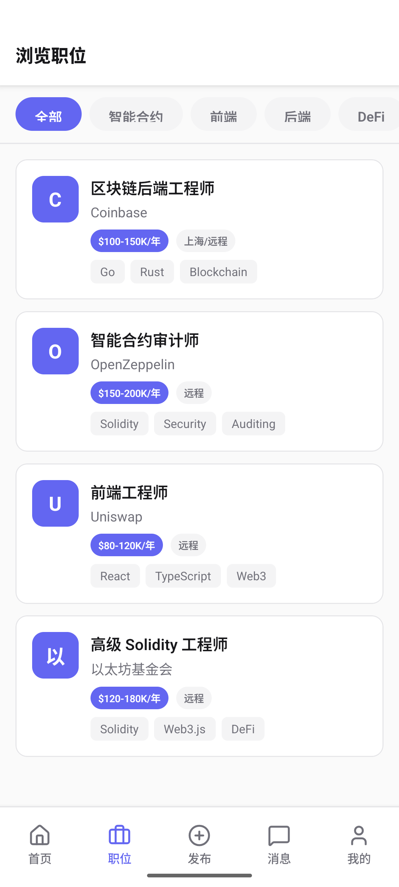
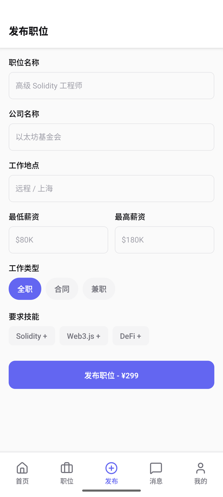
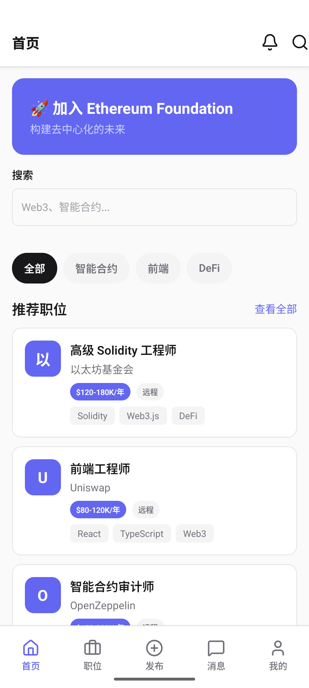
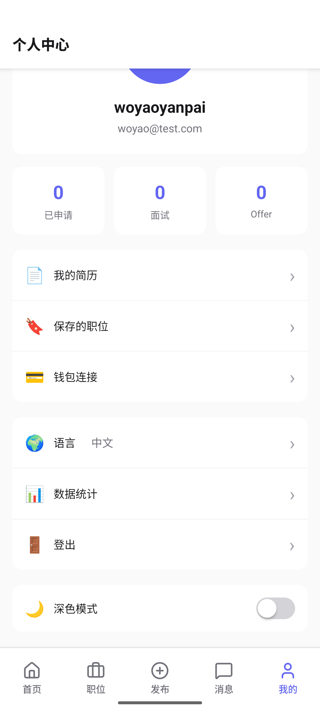
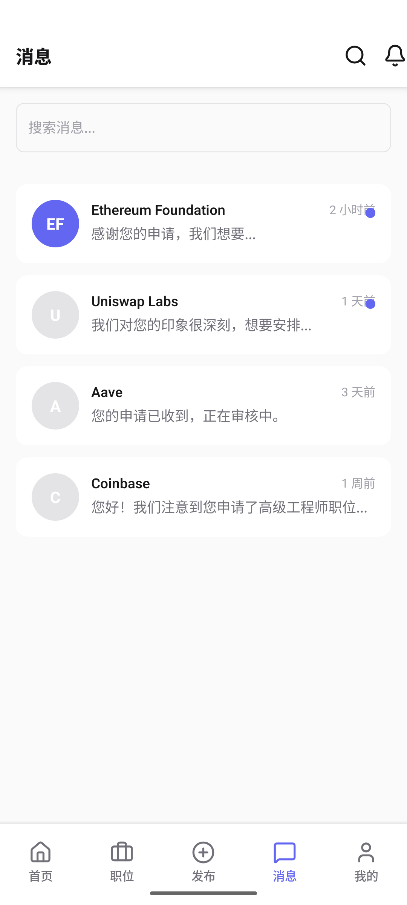
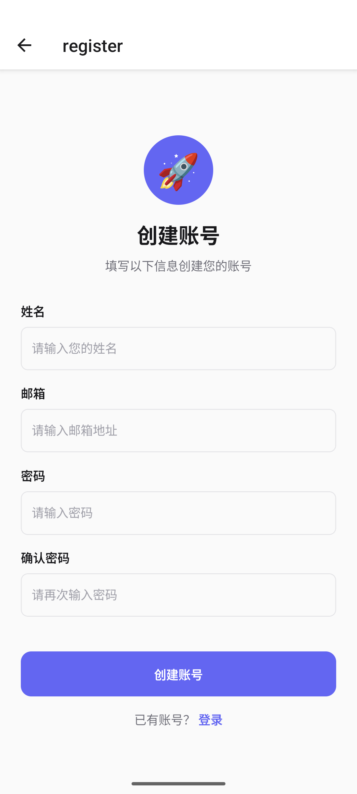

# Web3 Jobs - 去中心化招聘平台

> 一个基于区块链技术的 Web3 人才招聘平台，连接全球区块链开发者与顶级项目

[](https://reactnative.dev/)
[](https://nestjs.com/)
[](https://www.postgresql.org/)
[](LICENSE)

---

## 📱 应用预览

### 首页推荐
<p align="center">
  
</p>

### 职位浏览
<p align="center">
  
</p>

### 发布职位
<p align="center">
  
</p>

### 消息中心
<p align="center">
  
</p>

### 个人中心
<p align="center">
  
</p>

### 用户注册
<p align="center">
  
</p>

---

## ✨ 核心功能

### 👤 求职者
- 🔐 多种登录方式：邮箱密码 / Web3 钱包签名 (SIWE)
- 📄 在线简历管理与作品集展示
- 💼 智能职位推荐与筛选
- 📬 实时消息通知与面试跟进
- ⭐ 收藏职位与申请状态追踪

### 🏢 招聘方
- 📝 一键发布职位（支持加密货币支付）
- 🎯 精准人才匹配与搜索
- 💬 与候选人直接沟通
- 📊 申请管理与筛选工具

### 🔗 Web3 特性
- 钱包连接与身份验证
- 加密货币薪资展示（USD/ETH 双标价）
- 区块链技能标签（Solidity, Web3.js, DeFi 等）
- 去中心化身份验证 (SIWE - Sign In with Ethereum)

---

## 🛠 技术架构

```
┌─────────────────────────────────────────────────────────────┐
│                    Web3 Jobs Platform                        │
├─────────────────────────────────────────────────────────────┤
│  ┌─────────────────┐           ┌─────────────────────────┐  │
│  │   React Native  │◄─────────►│      NestJS Backend     │  │
│  │   (Expo SDK 55) │   REST    │  ┌───────────────────┐  │  │
│  │  ┌───────────┐  │   API     │  │  Prisma ORM       │  │  │
│  │  │ Zustand   │  │           │  │  (PostgreSQL)     │  │  │
│  │  │ (State)   │  │           │  └───────────────────┘  │  │
│  │  ┌───────────┐  │           │  ┌───────────────────┐  │  │
│  │  │React Query│  │           │  │  JWT + Passport   │  │  │
│  │  │ (Data)    │  │           │  │  Auth System      │  │  │
│  │  └───────────┘  │           │  └───────────────────┘  │  │
│  │  NativeWind    │           │  ethers.js / SIWE       │  │
│  │  (Tailwind)    │           │  Web3 Integration       │  │
│  └─────────────────┘           └─────────────────────────┘  │
└─────────────────────────────────────────────────────────────┘
```

### 前端技术栈

| 技术 | 版本 | 用途 |
|------|------|------|
| React Native | 0.83.2 | 跨平台移动应用 |
| Expo | 55.0.3 | 开发工具链 |
| TypeScript | 5.9.2 | 类型安全 |
| Zustand | 5.0.11 | 状态管理 |
| React Query | 5.90.21 | 数据获取 |
| NativeWind | 4.2.2 | Tailwind CSS |
| React Navigation | 7.x | 路由导航 |
| Lucide Icons | 0.575.0 | 图标系统 |
| Zod | 4.3.6 | 表单验证 |

### 后端技术栈

| 技术 | 版本 | 用途 |
|------|------|------|
| NestJS | 11.0.1 | API 框架 |
| Prisma | 6.19.2 | 数据库 ORM |
| PostgreSQL | - | 关系数据库 |
| JWT | - | 身份认证 |
| Passport | 0.7.0 | 认证中间件 |
| ethers.js | 6.16.0 | Web3 交互 |
| SIWE | 3.0.0 | 钱包登录 |
| bcrypt | 6.0.0 | 密码加密 |

---

## 📦 项目结构

```
.
├── web3-job-app/              # React Native 前端
│   ├── app/                   # Expo Router 路由
│   │   ├── (tabs)/           # 底部导航页
│   │   │   ├── index.tsx     # 首页
│   │   │   ├── jobs.tsx      # 职位列表
│   │   │   ├── post.tsx      # 发布职位
│   │   │   ├── messages.tsx  # 消息
│   │   │   └── profile.tsx   # 个人中心
│   │   └── job/[id].tsx      # 职位详情
│   ├── components/           # UI 组件库
│   ├── lib/                  # 工具函数
│   └── store/                # Zustand stores
│
├── web3-api/                 # NestJS 后端
│   ├── src/
│   │   ├── auth/             # 认证模块
│   │   ├── users/            # 用户模块
│   │   ├── jobs/             # 职位模块
│   │   ├── applications/     # 申请模块
│   │   ├── messages/         # 消息模块
│   │   ├── wallet-profiles/  # 钱包档案
│   │   └── web3/             # 区块链集成
│   └── prisma/               # 数据库迁移与种子
│
└── assets/                   # 项目资源
```

---

## 🚀 快速开始

### 环境要求

- Node.js >= 18.x
- npm >= 9.x
- Docker & Docker Compose
- Expo CLI (前端)
- NestJS CLI (后端)

### 1. 克隆项目

```bash
git clone https://github.com/your-username/web3-jobs.git
cd web3-jobs
```

### 2. 启动数据库

```bash
cd web3-api
docker-compose up -d
```

### 3. 配置后端

```bash
cd web3-api

# 安装依赖
npm install

# 复制环境变量
cp .env.example .env

# 生成 Prisma Client
npm run prisma:generate

# 运行数据库迁移
npm run prisma:migrate

# 插入测试数据
npm run prisma:seed

# 启动开发服务器
npm run start:dev
```

### 4. 启动前端

```bash
cd web3-job-app

# 安装依赖
npm install

# 启动 Expo
npm start

# 扫描屏幕二维码在真机上运行
# 或按 a 在 Android 模拟器 / i 在 iOS 模拟器
```

---

## 📖 API 文档

### 认证接口

| 方法 | 端点 | 描述 |
|------|------|------|
| POST | `/api/auth/register` | 用户注册 |
| POST | `/api/auth/login` | 邮箱登录 |
| POST | `/api/auth/siwe` | 钱包签名登录 |
| GET | `/api/auth/profile` | 获取用户信息 |

### 职位接口

| 方法 | 端点 | 描述 |
|------|------|------|
| GET | `/api/jobs` | 获取职位列表 |
| GET | `/api/jobs/:id` | 获取职位详情 |
| POST | `/api/jobs` | 发布职位 (需认证) |
| PUT | `/api/jobs/:id` | 更新职位 (需认证) |
| DELETE | `/api/jobs/:id` | 删除职位 (需认证) |

### 申请接口

| 方法 | 端点 | 描述 |
|------|------|------|
| POST | `/api/applications` | 申请职位 (需认证) |
| GET | `/api/applications/my` | 我的申请 (需认证) |

---

## 🧪 测试账户

项目包含预置的测试账户：

```
管理员账户:
邮箱：admin@web3jobs.com
密码：password123

普通用户:
邮箱：user@web3jobs.com
密码：password123
```

---

## 🔒 安全配置

### 生产环境部署

在部署到生产环境前，请确保：

1. **修改 JWT 密钥**
```bash
# 生成强随机密钥
openssl rand -base64 32
# 或
node -e "console.log(require('crypto').randomBytes(32).toString('hex'))"
```

2. **修改数据库密码**
```bash
# 编辑 web3-api/.env
POSTGRES_PASSWORD=<你的强密码>
```

3. **配置 HTTPS**
```bash
# 使用 Nginx 或 Vercel 等反向代理
```

---

## 📝 开发说明

### 数据库操作

```bash
cd web3-api

# 查看数据库
npm run prisma:studio

# 创建新迁移
npx prisma migrate dev --name <description>

# 重置数据库 (开发环境)
npx prisma migrate reset
```

### 前端调试

```bash
cd web3-job-app

# 清除缓存重启
npx expo start -c

# 生成新的构建
npx expo run:android
npx expo run:ios
```

---

## 🤝 贡献

欢迎贡献代码！请遵循以下步骤：

1. Fork 本仓库
2. 创建特性分支 (`git checkout -b feature/AmazingFeature`)
3. 提交更改 (`git commit -m 'Add some AmazingFeature'`)
4. 推送到分支 (`git push origin feature/AmazingFeature`)
5. 开启 Pull Request

---

## 📄 开源协议

MIT License - 详见 [LICENSE](LICENSE) 文件

---

## 📬 联系方式

- 作者：woyaoyanpai
- 邮箱：woyao@test.com
- 项目链接：https://github.com/your-username/web3-jobs

---

## 🙏 致谢

- [NestJS](https://nestjs.com/) - 优秀的 Node.js 框架
- [Prisma](https://www.prisma.io/) - 下一代数据库 ORM
- [Expo](https://expo.dev/) - React Native 开发平台
- [Ethers.js](https://docs.ethers.org/) - 以太坊交互库
- [SIWE](https://login.xyz/) - 去中心化身份认证

---

<div align="center">
  <strong>Made with ❤️ for Web3 Community</strong>
</div>
